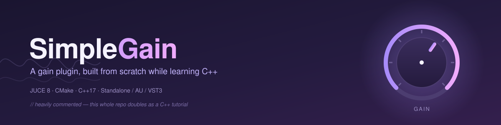

<a href="#an-overview">An overview</a> | <a href="#key-features">Key features</a> | <a href="#tech-stack">Tech stack</a> | <a href="#get-started">Get started</a> | <a href="#status">Status</a> | <a href="#built-with-claude-ai">Built with Claude AI</a> | <a href="#contributing">Contributing</a> | <a href="#license">License</a>

## An overview

**SimpleGain** is a volume/gain plugin for Logic, GarageBand, Reaper, Ableton and friends,
built from absolute scratch using [JUCE](https://juce.com/) and CMake.

This is a **test / learning project**, not a polished product — I'm a C# developer teaching
myself C++ and audio DSP, one plugin at a time, and gain is deliberately the simplest possible
starting point: the actual signal processing is one multiply. All the real learning is in the
*architecture*; how a plugin talks to a host, how the audio thread's rules differ from
everything else you've written and what C++ is doing that C# quietly does for you.

Because of that, **the code is littered with comments** and is closer to a tutorial than production
source. Every C++ construct gets a "what this is / why it's here" note, often with
a C# comparison. If you're coming from a managed language and finding your footing in C++ or
audio programming, I hope this is useful — there aren't nearly enough audio
programming resources out there and maybe this fills a tiny gap.

**Use it for whatever you like.** Fork it, strip it down, build on top of it, use it to learn - whatever. And if you spot something wrong or have a better
way to do it, I'd love to hear it: see [Contributing](#contributing).

<div align="right">[ <a href="#an-overview">↑ Back to top ↑</a> ]</div>

---

## Key features

🎚️ Builds as **Standalone**, **Audio Unit (AU)**, and **VST3** from one CMake project

🎚️ AU validated end-to-end with Apple's own `auval` — Logic and GarageBand will load it

🎚️ Every source file is heavily commented, explaining not just *what* the code does but *why* —
in JUCE, in C++ and in real-time audio specifically

🎚️ Built entirely with CMake, so it's IDE-agnostic — CLion, VS Code, Xcode, Visual Studio all
work from the same `CMakeLists.txt`

<div align="right">[ <a href="#an-overview">↑ Back to top ↑</a> ]</div>

---

## Tech stack


<div align="right">[ <a href="#an-overview">↑ Back to top ↑</a> ]</div>

---

## Get started

**1. Clone the repository — including the JUCE submodule**

JUCE is vendored as a git submodule rather than committed directly, so `--recurse-submodules`
is essential — skip it and `libs/JUCE` will be empty, which produces a confusing CMake error
rather than an obvious one.

```bash
git clone --recurse-submodules https://github.com/milliedavidson/SimpleGain.git
```

---

**2. Build**

Either open the folder in **CLion** (it detects the CMake project automatically — pick the
`SimpleGain_Standalone` target and hit Run), or from the terminal:

```bash
cmake -B build -DCMAKE_BUILD_TYPE=Debug
cmake --build build --target SimpleGain_Standalone -j 8
```

First configure builds JUCE's `juceaide` helper tool and takes ~90 seconds. After that, builds
are incremental.

---

**3. Run it**

```bash
open build/SimpleGain_artefacts/Debug/Standalone/SimpleGain.app
```

The Standalone build is the fast development loop — a real `.app` you can run without a DAW,
with its own Audio/MIDI settings (**Options → Audio/MIDI Settings**) for picking an input and
output device.

---

**4. Build the plugin formats and validate**

```bash
cmake --build build --target SimpleGain_AU SimpleGain_VST3 -j 8
```

`COPY_PLUGIN_AFTER_BUILD` installs both automatically to
`~/Library/Audio/Plug-Ins/Components` and `~/Library/Audio/Plug-Ins/VST3`. To check the AU the
same way Logic will before it loads it:

```bash
auval -v aufx Sgai Mxdp
```

<div align="right">[ <a href="#an-overview">↑ Back to top ↑</a> ]</div>

---

## Status

Built one verified phase at a time — nothing below is marked done unless it's actually been
built and run.

- [x] Project scaffold — CMake, JUCE 8 as a submodule, no Projucer
- [x] `AudioProcessor` skeleton — pass-through audio, proves the toolchain end-to-end
- [x] Standalone, AU and VST3 all building
- [x] AU validated with `auval`
- [x] macOS microphone/Bluetooth privacy permissions (TCC) handled correctly
- [x] An actual gain parameter (`AudioProcessorValueTreeState`), host-automatable, -60 to +12 dB
- [ ] Sample-accurate gain smoothing (no zipper noise)
- [ ] State save/restore
- [ ] A real GUI (currently JUCE's generic editor)
- [ ] Universal binary (Apple Silicon + Intel)

<div align="right">[ <a href="#an-overview">↑ Back to top ↑</a> ]</div>

---

## Built with Claude AI

Full disclosure: I'm building this in collaboration with [Claude](https://claude.ai) —
Anthropic's AI assistant. It's writing code alongside me, explaining the C++ and JUCE concepts
as we go and I'm reviewing and steering every step of it.

<div align="right">[ <a href="#an-overview">↑ Back to top ↑</a> ]</div>

---

## Contributing

Spotted a bug, a bad explanation, or a better way to do something? I'd love to know —
no software is 100% perfect, but I strive to get as close as possible 🙂

- **Comment on a line** or open an issue if something looks off
- **Open a PR** if you'd rather just fix it

<div align="right">[ <a href="#an-overview">↑ Back to top ↑</a> ]</div>

---

## License

SimpleGain's own source code is licensed under the [MIT License](LICENSE).

[](https://opensource.org/licenses/MIT)

> **Note:** JUCE itself (vendored as a submodule at `libs/JUCE`) is **not** covered by this
> licence — it's dual-licensed under AGPLv3 or Avid's commercial JUCE licence. See
> [`libs/JUCE/LICENSE.md`](libs/JUCE/LICENSE.md) for the terms that apply to JUCE itself.

---

```text
MIT License

Copyright (c) 2026 Maxximum Displacement

Permission is hereby granted, free of charge, to any person obtaining a copy of this software
and associated documentation files (the "Software"), to deal in the Software without
restriction, including without limitation the rights to use, copy, modify, merge, publish,
distribute, sublicense, and/or sell copies of the Software, and to permit persons to whom the
Software is furnished to do so, subject to the following conditions:

The above copyright notice and this permission notice shall be included in all copies or
substantial portions of the Software.

THE SOFTWARE IS PROVIDED "AS IS", WITHOUT WARRANTY OF ANY KIND, EXPRESS OR IMPLIED, INCLUDING
BUT NOT LIMITED TO THE WARRANTIES OF MERCHANTABILITY, FITNESS FOR A PARTICULAR PURPOSE AND
NONINFRINGEMENT. IN NO EVENT SHALL THE AUTHORS OR COPYRIGHT HOLDERS BE LIABLE FOR ANY CLAIM,
DAMAGES OR OTHER LIABILITY, WHETHER IN AN ACTION OF CONTRACT, TORT OR OTHERWISE, ARISING FROM,
OUT OF OR IN CONNECTION WITH THE SOFTWARE OR THE USE OR OTHER DEALINGS IN THE SOFTWARE.
```

<div align="right">[ <a href="#an-overview">↑ Back to top ↑</a> ]</div>
