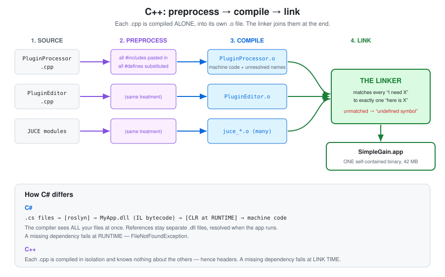
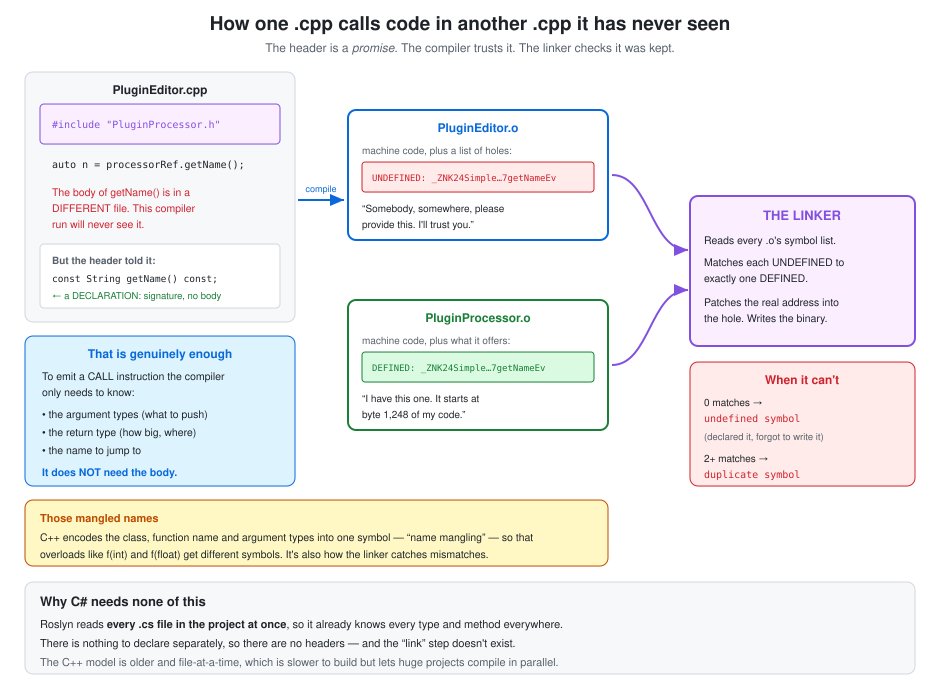
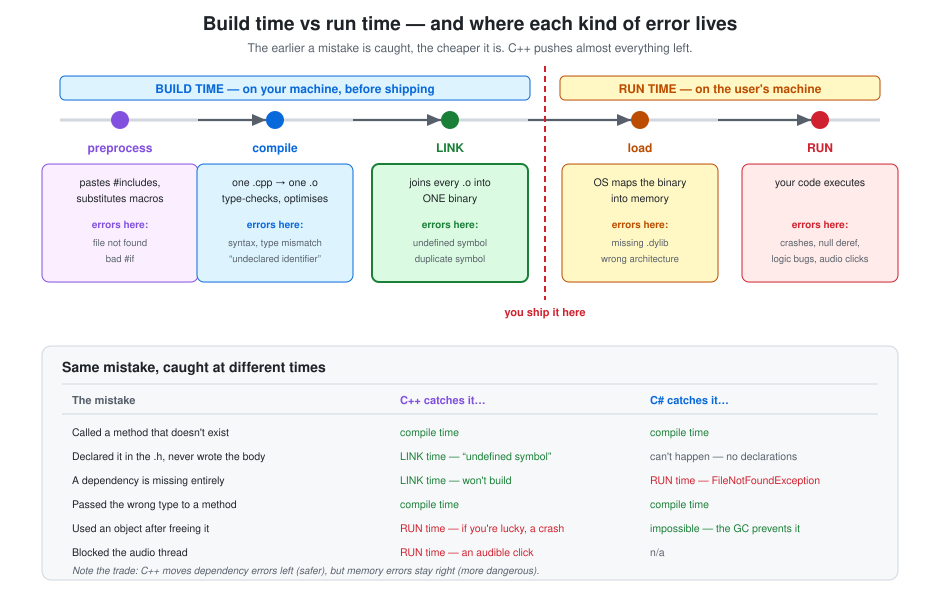

# C++ build pipeline

What actually happens between writing `.cpp`/`.h` files and getting a runnable binary —
the preprocessor, the compiler, the linker — and how that compares to Roslyn and the CLR.

**SimpleGain docs** · [Index](README.md)  
**The plugin:** [Plan](plan.md) · [Hosting & threads](plugin-hosting-and-threads.md) · [Parameters & automation](parameters-and-automation.md) · [Identity & macOS](plugin-identity-and-macos.md)  
**C++ foundations:** [Memory model](cpp-memory-model.md) · **Build pipeline**  
**Workflow:** [Dev tooling](dev-workflow-and-tooling.md) · [Testing](testing.md) · [CI & GitHub Actions](ci-and-github-actions.md)

---

## In short

- **`#include` is literal copy-paste** performed by the preprocessor, not C#'s `using`. Hence
  `#pragma once`.
- **Each `.cpp` compiles alone** into a `.o` file, knowing nothing about any other file. The
  header is a *promise* the compiler takes on trust.
- **The linker checks the promise was kept** — matching every "I need this symbol" to exactly
  one "I have it". `undefined symbol` means you declared something and never wrote it.
- **C# has no link step**: Roslyn reads every `.cs` at once and the CLR resolves references at
  *run time*, which is why a missing dependency fails on the user's machine rather than yours.
- **C++ has no portable binary** — no IL, no JIT. One build per CPU architecture, and for
  plugin formats, one thin wrapper per host API around the same compiled code.

---

## 1. The JUCE headers — is it like `using` directives in C#?

**Yes, that's a good analogy, with one important difference.**

The old JUCE way generates a single `JuceHeader.h` containing everything, and every file does:

```cpp
#include <JuceHeader.h>     // ~everything JUCE has
```

The modern way, which we're using, includes only the modules a file actually needs:

```cpp
#include <juce_audio_processors/juce_audio_processors.h>
```

The benefits:

1. **Compile speed.** This is the big one. `#include` is literal copy-paste (see §2), so
   `JuceHeader.h` pastes hundreds of thousands of lines into *every* `.cpp` — and the compiler
   re-parses all of it, once per file. Including only what you need can cut build times
   dramatically.
2. **Explicit dependencies.** You can see at a glance what a file relies on.
3. **No global `using namespace juce`.** `JuceHeader.h` traditionally dumps all of JUCE into
   the global namespace, so `String` means `juce::String` everywhere. Convenient until it
   collides with something. We write `juce::` explicitly.

**The difference from C#:** a C# `using` is *free*. It's just a lookup hint to the compiler —
zero cost. A C++ `#include` physically pastes a file in and the compiler parses all of it.
So in C# nobody cares how many `using`s you have; in C++ it directly costs build time.

---

## 2. What is the preprocessor?

The **preprocessor** is a simple text-substitution program that runs over your source *before
the compiler sees it*. It doesn't understand C++ at all — it doesn't know what a class or a
function is. It only knows how to shuffle text around.

It obeys the lines starting with `#`:

| Directive | What it does |
|---|---|
| `#include "foo.h"` | Replace this line with the entire contents of `foo.h` |
| `#define X 1` | From here on, replace the text `X` with the text `1` |
| `#ifdef` / `#if` / `#endif` | Keep or delete this block of text |
| `#pragma` | A compiler-specific instruction (see §3) |

So when `CMakeLists.txt` said `JUCE_WEB_BROWSER=0`, it defined a macro. Inside JUCE there's
code like:

```cpp
#if JUCE_WEB_BROWSER
    ... thousands of lines of browser code ...
#endif
```

and the preprocessor **physically deletes those lines** before compilation. It's not disabled
at runtime — it does not exist in the binary.

**C# comparison:** C# has a deliberately tiny preprocessor — just `#if DEBUG`, `#region` and
friends. It has no `#include` (the compiler reads whole projects) and **no macros** — this was
a deliberate design decision, because macros are notoriously easy to abuse. C++ leans on its
preprocessor far more heavily, which is why you see things like
`JUCE_DECLARE_NON_COPYABLE_WITH_LEAK_DETECTOR` — a macro that expands into real code.

---

---

## 3. What does `#pragma` mean? Is it an abbreviation?

Not an abbreviation — it's from the Greek **πρᾶγμα** (*pragma*), meaning "a deed" or "a thing
done". Same root as "pragmatic". In computing it's the long-established word for *a directive
to the compiler that isn't part of the language itself*.

The C++ standard basically says: "`#pragma` means whatever your particular compiler wants it to
mean; ignore any you don't recognise."

So `#pragma once` means: **"compiler, please include this file only once per translation unit."**

It isn't officially in the C++ standard — but every compiler that matters (clang, gcc, MSVC)
supports it, so it's universal in practice.

The standard-approved alternative is an *include guard*, which does the same job using only
official features:

```cpp
#ifndef PLUGIN_PROCESSOR_H      // if this name isn't defined yet...
#define PLUGIN_PROCESSOR_H      // ...define it, so we skip this next time
   ... file contents ...
#endif
```

`#pragma once` is one line instead of three and can't break from a copy-paste name collision,
so most modern code uses it.

**Why either is needed:** since `#include` is literal copy-paste, including the same header
twice would paste the class definition twice, and C++ forbids defining a class twice. With
headers including other headers, this happens constantly and by accident.

---

## 4. The compile → link → binary pipeline



### What a compiler actually does

A compiler translates human-readable source into machine instructions the CPU can execute. For
C++ it happens in three stages:

**Stage 1 — Preprocess.** Pure text manipulation (see §2). Output: one gigantic `.cpp` with
every `#include` pasted in and every macro substituted. This is called a *translation unit*.

**Stage 2 — Compile.** The real work: parse, type-check, optimise, and emit machine code into
an **object file** (`.o`). Crucially, **each `.cpp` is compiled completely alone**. When
`PluginEditor.cpp` calls a function defined in `PluginProcessor.cpp`, the compiler doesn't have
that code. It just writes down "I need something called
`SimpleGainAudioProcessor::getName`" and leaves a hole.

**Stage 3 — Link.** The linker collects every `.o` file, and matches every "I need X" to
exactly one "here is X". Then it patches the real addresses in and writes one binary.

- No definition found → **"undefined symbol"** — the classic C++ link error.
- Two definitions found → **"duplicate symbol"**.

Our build compiled ~50 files into `.o`s, then linked them into a single 42 MB binary.

### Against C#

```
C#:   .cs files ──[compiler]──► MyApp.dll (IL bytecode)
                                    │
                                    └──[CLR, at RUNTIME]──► machine code, JIT'd on demand

C++:  .cpp files ──[compiler]──► .o files ──[linker]──► one native binary
```

Three real differences:

1. **When it becomes machine code.** C# compiles to IL and the CLR JIT-compiles it *while the
   program runs*. C++ produces machine code up front — which is why there's no warm-up and no
   runtime needed.
2. **What the compiler can see.** Roslyn reads your whole project at once, so it knows every
   type everywhere. That's why C# has no headers. A C++ compiler sees one file at a time.
3. **When dependencies are resolved.** A C# reference stays a separate `.dll`, found at
   *runtime*. A C++ dependency is baked in at *link time*. Miss one in C# → runtime
   `FileNotFoundException`. Miss one in C++ → it won't build.

---

## 5. What is a `.o` file? And is a `.cpp` file just... a file?

### Is a `.cpp` just a file with C++ in it?

**Yes. Exactly that.** There's no magic, no special job, no required structure. It's a plain
text file that happens to contain C++ and happens to end in `.cpp`.

You could name it `.cc`, `.cxx`, or `banana` — the compiler mostly cares because the extension
is a *hint* about what language it holds. What actually matters is that something tells the
compiler to compile it, and for us that's this line in `CMakeLists.txt`:

```cmake
target_sources(SimpleGain PRIVATE
    Source/PluginProcessor.cpp
    Source/PluginEditor.cpp)
```

Two files are listed, so two files get compiled. Add a `.cpp` to the folder and *don't* list it
and it will simply be ignored — a common early stumble.

**The one real rule:** `.cpp` files get compiled; `.h` files never do. A header is only ever
pasted into a `.cpp` by `#include`. That's the distinction that actually matters, and it's
convention enforced by the build system rather than by the language.

> This differs from modern C#, where an SDK-style `.csproj` globs `**/*.cs` automatically and
> you never list files. In CMake you list them explicitly.

### So what's a `.o` file?

**`.o` = "object file".** It's the compiler's output for *one* `.cpp`: machine code, but not
yet a runnable program.

Think of it as a page torn out of a finished book — real printed text, but with blanks where
cross-references to other pages should be, because it was printed before anyone knew the page
numbers.

An object file contains:

| Part | What it is |
|---|---|
| **Machine code** | The actual CPU instructions for the functions in this file |
| **Data** | String literals, constants, static variables |
| **Exported symbols** | "I contain these functions, at these offsets" |
| **Undefined symbols** | "I *call* these functions, but I don't have them" |
| **Relocations** | "Once you know the real addresses, patch them in at these spots" |

It is not executable. It has no `main`, no idea where anything else lives, and the OS can't run
it. It only becomes runnable after the **linker** fills in every blank.

Ours are in `build/CMakeFiles/SimpleGain.dir/Source/` — have a look:

```bash
cd /Users/millie/Documents/Programming/REPOS/Audio/SimpleGain
find build -name "PluginProcessor.cpp.o"
nm -C build/CMakeFiles/SimpleGain.dir/Source/PluginProcessor.cpp.o | head -30
```

`nm` lists the symbol table. `-C` "demangles" the names into readable C++. `T` means
*defined here*; `U` means *undefined — someone else must supply it*.

Real output from our own build:

```
0000000000000a90 T createPluginFilter()
0000000000000950 T SimpleGainAudioProcessor::getName() const
                 U juce::AudioProcessor::getNameForMidiNoteNumber(int, int)
```

Read that as: *"I contain `createPluginFilter` at offset 0xa90 and `getName` at 0x950. I also
need `getNameForMidiNoteNumber`, which I do not have — note the blank address. Linker, find it."*

That one object file defines **156** symbols and leaves **86** undefined. Every one of those 86
blanks has to be filled by the linker, or the build fails.

C# has a rough analogue in the `.netmodule`, but almost nobody uses it — C# compiles a whole
project straight to one `.dll`.

---

## 6. How do headers let one `.cpp` know about another?

> *"How can the compiler know anything about the other files if it only gets a .cpp in
> isolation? Does it see the header and look in that .cpp and build some context?"*

**It does not look in the other `.cpp`. It never opens it. It doesn't even know it exists.**

That's the surprising part, and once it clicks the whole model makes sense.



### The trick: you don't need the body to call a function

To generate a *call*, the compiler needs to know only:

1. **What to pass** — the argument types, so it knows what to put where
2. **What comes back** — the return type, so it knows how much space to reserve
3. **What to call it** — a name

It does **not** need to know what the function *does*. Compare with C#: you can call a method
on a NuGet package without its source, because the `.dll` carries the signatures. A header is
the same idea, written out by hand.

So this is enough:

```cpp
// PluginProcessor.h — a DECLARATION. Signature, semicolon, no body.
const juce::String getName() const;
```

### What actually gets emitted

When `PluginEditor.cpp` is compiled:

1. The preprocessor pastes `PluginProcessor.h` in, so the compiler sees the declaration.
2. It type-checks the call against that signature. Wrong argument types → compile error.
3. It emits a `call` instruction to a **symbol name** — with the destination address left
   blank.
4. It records in `PluginEditor.o`: *"UNDEFINED: `_ZNK24SimpleGainAudioProcessor7getNameEv`.
   Somebody please provide this."*

Separately, `PluginProcessor.cpp` is compiled, contains the actual body, and records:
*"DEFINED: `_ZNK24SimpleGainAudioProcessor7getNameEv`, at offset 1248."*

Neither compilation knew about the other. Then the **linker** reads both symbol lists, matches
the undefined to the defined, patches the real address into the blank, and it's a working call.

### Declaration vs definition — the vocabulary

| | What it is | Where it lives | How many allowed |
|---|---|---|---|
| **Declaration** | The signature. A promise that this exists somewhere. | `.h` | As many as you like |
| **Definition** | The body. The actual code. | `.cpp` | **Exactly one** |

That "exactly one" is the **One Definition Rule**, and it's why headers hold declarations while
`.cpp` files hold definitions. A header gets pasted into many `.cpp` files — so if it held a
body, you'd get many copies and a `duplicate symbol` error.

### Those mangled names

`_ZNK24SimpleGainAudioProcessor7getNameEv` is the real symbol. C++ **mangles** names, encoding
the class, the function name, the argument types and constness into one string. It has to,
because C++ allows overloading: `f(int)` and `f(float)` are different functions and need
different symbols. It's also a safety net — if the header and the definition disagree, the
mangled names differ and you get a link error rather than silent corruption.

### The catch: the compiler *trusts* the header

The header is a promise, and the compiler takes it at face value. If you lie — declare
`int getName()` in the header but define `String getName()` in the `.cpp` — the compiler is
happy with both files separately, and the linker reports an undefined symbol, because the
mangled names don't match.

That's the real cost of this design, and why headers and sources must be kept in step.

---

## 7. Roslyn and IL bytecode

Two pieces of the C# machinery worth naming, because the C++ comparison only makes sense once
you know what they are.

### Roslyn

**Roslyn is the C# compiler.** (Officially "the .NET Compiler Platform"; "Roslyn" was the
codename and it stuck.) When you press Build in Visual Studio or run `dotnet build`, Roslyn is
what runs.

Two things make it notable:

- **It's written in C#** — the C# compiler is itself a C# program. (Common, this; it's called
  self-hosting.)
- **It's a "compiler as a service."** It exposes its syntax trees and semantic model as an API,
  which is why IntelliSense, "Find all references", Rename, and analyzers all work so well:
  they're asking the actual compiler, not a separate parser that approximates it.

The C++ equivalent in our project is **clang**, which similarly exposes its internals — that's
how CLion does its code intelligence.

### IL bytecode

Here's the thing that surprises people: **`dotnet build` does not produce machine code.**

```
Program.cs ──[Roslyn]──► MyApp.dll   ← this contains IL, not x86 instructions
```

**IL** (Intermediate Language; also CIL or MSIL) is an instruction set for an *imaginary*
computer. No physical CPU can execute it. It's stack-based and much simpler than real machine
code:

```csharp
int Add(int a, int b) => a + b;
```

compiles to roughly:

```
ldarg.0     // push argument 0 onto the stack
ldarg.1     // push argument 1
add         // pop two, add, push result
ret         // return top of stack
```

Real x86 would instead name specific registers — `mov eax, edi` / `add eax, esi`.

**Why bother?** Portability. The same `.dll` runs on x86 Windows, Arm Macs and Linux servers,
because IL commits to no particular CPU. The **JIT** (Just-In-Time compiler) inside the .NET
runtime translates IL into real machine code *as the program runs*, and can optimise for the
exact chip it finds itself on.

The cost: a startup warm-up, a runtime that must be installed, and — the one that matters to us
— **a garbage collector that can pause your thread whenever it likes.**

| | C# | C++ |
|---|---|---|
| Compiler output | IL bytecode in a `.dll` | Real machine code |
| Needs a runtime installed? | Yes (.NET) | No |
| When does it become machine code? | At run time, by the JIT | At build time |
| Startup | JIT warm-up | Instant |

This is why our plugin had to be built for `x86_64` specifically, and why shipping to Apple
Silicon users means building a second architecture.

---

## 8. Run time vs link time



They're two different *moments in the life of your program*, and the distinction matters mainly
because it determines **when a given mistake is discovered**.

| Phase | When | Who's running | Typical failure |
|---|---|---|---|
| **Compile time** | You press Build | The compiler | `error: no member named 'gian'` |
| **Link time** | Straight after | The linker | `undefined symbol: getName()` |   
| **Load time** | User double-clicks | The OS loader | `dylib not found` |
| **Run time** | While it's running | Your code, on the CPU | Crash, wrong output, audio click |

**Link time** is the last moment of *building*. The linker has every `.o`, and its job is
matching every "I need X" to a "here is X". Nothing is executing — it's just resolving names
and patching addresses. When it finishes you have a file on disk.

**Run time** is when the CPU actually executes your instructions. The program is alive, has
memory, has threads. Everything the user experiences happens here.

### Why this is *the* difference between C# and C++ dependency handling

Suppose your program needs a library and it isn't there.

**C++** — the dependency is baked into the binary at link time:

```
missing at LINK time  →  "undefined symbol"  →  the build fails on YOUR machine
```

You find out immediately, before shipping. Once it builds, that dependency is *inside* the
binary — it can't go missing later.

**C#** — references stay as separate `.dll`s and are resolved at run time:

```
missing at RUN time  →  FileNotFoundException  →  it fails on the USER'S machine
```

It compiles fine, ships fine, and dies in front of a customer. This is the whole "DLL hell"
genre of problem, and why .NET has assembly binding redirects and `deps.json`.

**The trade-off, stated plainly:** C++ moves dependency errors *earlier* (safer — you can't
ship a missing dependency), but leaves memory errors *later* (more dangerous — use-after-free
is a runtime crash). C# does the opposite. Neither is strictly better; they optimise for
different failure modes.

The GC that comes with the runtime is exactly why C# can't do audio DSP.

---

## 9. No portable binary — does that mean separate C++ code per format and per OS?

Two different questions tangled into one, worth pulling apart — because the answer is
**"yes" for one axis and "no" for the other**, and I checked our actual build to be sure rather
than guessing.

### Axis 1: CPU architecture (Intel vs Apple Silicon) — yes, compiled separately

C++ has no IL/JIT step (§28), so a compiled binary targets **one specific CPU instruction set**.
Our build right now is:

```
$ file build/.../SimpleGain
SimpleGain: Mach-O 64-bit executable x86_64
```

That binary will not run on an Apple Silicon Mac at all (different instructions entirely) and
obviously not on Windows (different OS, different binary format — `.exe`/`.dll` vs Mach-O). To
support Apple Silicon too, the same source gets **compiled a second time**, targeting `arm64`,
and macOS lets you glue both results into one file — a **"universal binary"** (also called a
"fat binary"): one file on disk containing two complete compiled copies, and the OS picks the
right slice at launch. This is the `CMAKE_OSX_ARCHITECTURES "x86_64;arm64"` line mentioned in
Phase 8 of the plan. Windows and Linux don't have this trick — there you'd ship genuinely
separate installers per platform.

So for architecture: **same source, compiled twice, into either two files or one glued-together
file** — nothing at all like C#'s "one `.dll` runs everywhere via the CLR's JIT" model.

### Axis 2: plugin format (Standalone / AU / VST3) — one compile, different wrappers

This one surprised me enough that I went and checked our own build rather than trust memory. The
answer: **we do not write different C++ per format, and JUCE doesn't even recompile our code
per format.**

```
$ find build/CMakeFiles -name "PluginProcessor.cpp.o"
build/CMakeFiles/SimpleGain.dir/Source/PluginProcessor.cpp.o        ← only ONE

$ find build -name "libSimpleGain*"
build/SimpleGain_artefacts/Debug/libSimpleGain_SharedCode.a         ← a shared static library
```

`PluginProcessor.cpp` and `PluginEditor.cpp` — our actual code — get compiled **exactly once**,
into `libSimpleGain_SharedCode.a`. Then each format target (`SimpleGain_Standalone`,
`SimpleGain_AU`, `SimpleGain_VST3`) **links that same object code** against a different thin
JUCE-provided wrapper:

| Target | Extra wrapper file | What it implements |
|---|---|---|
| Standalone | `juce_audio_plugin_client_Standalone.cpp` | a real `main()`, a window, a connection to CoreAudio |
| AU | `juce_audio_plugin_client_AU_1/2.mm` | the Apple `AudioComponent` entry points Logic expects |
| VST3 | `juce_audio_plugin_client_VST3.mm` | Steinberg's `IPluginFactory` interface Ableton/Reaper expect |

Each wrapper's whole job is: satisfy that format's specific contract, then internally construct
our `SimpleGainAudioProcessor` and forward the host's calls straight into `processBlock`,
`prepareToPlay`, etc. — the same methods regardless of which host is calling. That's the entire
value JUCE adds here: without it, you'd hand-write your own AU component and your own VST3
factory, which is a large amount of format-specific boilerplate that has nothing to do with
your actual DSP.

The result is exactly what you predicted — **the same C++ compiled once, then packaged three
ways** — just via *linking* three different wrappers rather than via literally re-running the
compiler on our files three times. Confirmed by the file sizes, too: Standalone is 42 MB,
AU is 36.6 MB — different final binaries, same shared code inside both.
