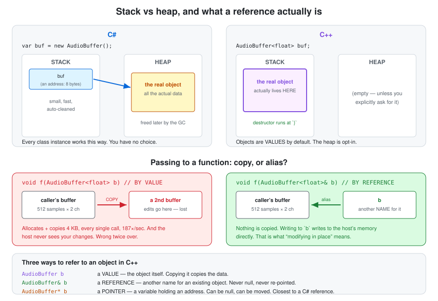

# C++ memory model

Stack vs heap, references vs pointers, `const`, and why C++ needs neither a garbage collector
nor manual bookkeeping to clean up after itself — until it does.

**SimpleGain docs** · [Index](README.md)  
**The plugin:** [Plan](plan.md) · [Hosting & threads](plugin-hosting-and-threads.md) · [Parameters & automation](parameters-and-automation.md) · [Identity & macOS](plugin-identity-and-macos.md)  
**C++ foundations:** **Memory model** · [Build pipeline](cpp-build-pipeline.md)  
**Workflow:** [Dev tooling](dev-workflow-and-tooling.md) · [Testing](testing.md) · [CI & GitHub Actions](ci-and-github-actions.md)

---

## In short

- **Objects are values by default.** `AudioBuffer<float> buf;` builds a real object on the
  stack — it is not a null reference waiting to be assigned, as the same line would be in C#.
- **The stack** is automatic and freed when scope ends; **the heap** is manual and lives until
  something frees it. Most C++ bugs that bite hard live on the heap.
- **A reference (`&`) is an alias** for the caller's object — never null, never rebindable.
  A pointer (`*`) can be null and can be reseated.
- **`const` is a compiler-enforced promise**, not a convention. C# has nothing equivalent.
- **Destructors run automatically and deterministically** at the closing brace. That's RAII,
  and it's why C++ needs no garbage collector — and why use-after-free is possible at all.

---

## 1. The stack and the heap



Two regions of memory your program uses, with very different rules.

### The stack

A region that grows and shrinks automatically as functions are called and return. Every
function call pushes a **stack frame** holding its local variables; when the function returns,
the frame is popped and everything in it is gone.

- **Very fast.** Allocating is just moving a pointer.
- **Automatic.** You never free it — returning does that.
- **Small.** Typically 1–8 MB per thread. Overflow it and you crash ("stack overflow").
- **Strictly ordered.** Last in, first out.

### The heap

A large pool of memory you request chunks from explicitly, which live until you release them.

- **Slower.** The allocator has to *find* a free chunk of the right size, and it takes a lock.
  This is precisely why heap allocation is banned on the audio thread.
- **Manual.** In C++ *you* are responsible for freeing it. In C# the GC does it for you.
- **Big.** Limited by your RAM.
- **Any order.** Objects can outlive the function that made them.

### The actual difference from C#

In **C#**, the rule is baked into the type:
- `class` → always on the heap; the variable holds a reference to it
- `struct` → on the stack (or inline in its containing object)

You don't choose per-object.

In **C++**, *you* choose, every time:

```cpp
juce::AudioBuffer<float> buf;                 // ON THE STACK. buf IS the object.
                                              // Dies automatically at the closing brace.

auto buf = std::make_unique<AudioBuffer<float>>();   // on the heap, owned by a smart pointer
                                                     // that frees it automatically

auto* buf = new juce::AudioBuffer<float>();   // on the heap, raw. YOU must `delete` it.
                                              // Modern C++ avoids this.
```

**This is the sentence to internalise:** in C#, `AudioBuffer buf;` declares a *reference that is
currently null*. In C++, `AudioBuffer<float> buf;` **constructs an actual object, right there,
on the stack.** Objects are values by default.

---

## 2. References vs pointers, "the caller's object", and "in place"

### What "the caller's object" means

When one function calls another, the **caller** is the one doing the calling. Here, the DAW is
the caller — it owns a buffer of audio and calls `processBlock`, passing it to us.

"The caller's object" = *that* buffer, the one living in Logic's memory. Not ours. We were
handed access to it.

### What "in place" means

Two ways to write a function that changes data:

```cpp
// NOT in place — returns a new thing, leaves the original untouched
AudioBuffer<float> applyGain (AudioBuffer<float> input);

// IN PLACE — modifies the thing it was given, returns nothing
void processBlock (AudioBuffer<float>& buffer);
```

In place = we reach into the caller's own memory and overwrite the numbers there. When we
return, Logic looks at the buffer it gave us and finds it changed. No copy, no handover.

You already know this distinction from C#/LINQ: `list.OrderBy(...)` returns a new sequence;
`list.Sort()` modifies in place.

### Why it matters so much here

If `processBlock` took the buffer **by value**:

```cpp
void processBlock (juce::AudioBuffer<float> buffer)   // note: no &
```

C++ would **copy the entire buffer** — allocate new memory, copy every sample — on every call.
That's a heap allocation on the audio thread (forbidden), ~4 KB copied 187 times a second, and
worst of all we'd be modifying *our copy*, which gets thrown away when the function returns.
The host would hear nothing.

With `&` there's no copy at all. `buffer` is simply **another name** for the host's object.

### And yes, this connects to the stack/heap

Directly. A reference is (in practice) implemented as an address — a small value living on our
stack frame that points at memory somewhere else. Copying an object means duplicating all its
data; taking a reference means copying just the address.

### So what IS a pointer, exactly?

> *"what is a pointer? another name for a value?"*

A **pointer is a variable whose value is a memory address.** That's it. Memory is a giant
numbered array of bytes; a pointer holds one of those numbers.

```cpp
int x = 42;          // x holds 42, living at (say) address 0x7ff8a03c
int* p = &x;         // p holds 0x7ff8a03c — the ADDRESS of x
int y = *p;          // y = 42. `*p` means "go to that address and read it"
```

Two operators to keep straight:
- `&x` — "the address of x" (makes a pointer)
- `*p` — "the thing at address p" (follows a pointer)

Confusingly `&` in a *type* means something else: `int& r = x;` declares a reference.

### Reference vs pointer vs C#

| | C++ reference `&` | C++ pointer `*` | C# class variable |
|---|---|---|---|
| Can be null? | **No** | Yes | Yes |
| Can be re-pointed? | **No** | Yes | Yes |
| Must be initialised? | **Yes** | No | No |
| Syntax to use it | `r.foo()` | `p->foo()` | `r.foo()` |

A C# class variable behaves most like a **C++ pointer** — it can be null, it can be reassigned,
and it refers to something elsewhere. A C++ *reference* is stricter than anything C# has: it
must point at a real object from birth to death. That's why `processBlock` takes `&` — "there
is definitely a buffer here, and it is definitely the host's".

---

## 3. `const` — "a compiler-enforced promise"

That quote was about `const`. Look at this signature:

```cpp
bool isBusesLayoutSupported (const BusesLayout& layouts) const override;
//                           ^^^^^ (1)                   ^^^^^ (2)
```

**(1) `const BusesLayout&`** — "I promise not to modify this argument." Try to, and it's a
compile error.

**(2) the trailing `const`** — "I promise this method does not modify the object it's called
on." Try to change any member, and it's a compile error.

Why it's a big deal in C++ and not C#:

- Because C++ passes by value by default, `const&` is how you say "let me look at this without
  copying it, and I won't touch it". It's *the* standard way to pass anything non-trivial.
- It's viral in a useful way: if you hold a `const` reference, you can only call `const`
  methods on it. The compiler propagates the guarantee.
- C#'s `readonly` only applies to fields, and `in` parameters are rare and much weaker. There
  is no way in C# to say "this method doesn't mutate this object" and have it enforced.

Rule of thumb: **mark everything `const` that can be.** It documents intent, prevents a class
of bugs, and occasionally lets the optimiser do better.

---

## 4. Destructors, and why C# needs a GC but C++ doesn't

> *"why does c# need a GC and c++ doesn't? Why do you have to clean up your objects in C++,
> when the destructor runs automatically? the object dies of its own accord or I have to tell
> it to?"*

### The core answer: C++ ties lifetime to scope

In C#, an object's lifetime is **unknown**. You write `new Foo()` and the object lives as long
as *something, somewhere* still references it. The runtime can't know when that stops being
true without going and checking — which is what the GC does, periodically, by scanning memory.

In C++, a stack object's lifetime is **completely determined by where it is written**:

```cpp
void doSomething()
{
    juce::AudioBuffer<float> buffer (2, 512);   // born here
    buffer.clear();
}                                               // dies HERE. Guaranteed. Always.
```

The compiler can *see* that `buffer` dies at the closing brace, so it simply emits a call to
the destructor at that point. No scanning, no runtime bookkeeping, no pauses. The cleanup is
just another instruction in the compiled code.

So: **you don't have to tell it to die.** It dies on its own, at a point you can predict by
reading the source.

### So where's the "cleaning up" I have to do?

Two situations:

**1. Stack objects — nothing to do.** This covers most modern C++, and all of our members.

**2. Heap objects — someone must own them.** If you `new` something, it lives until someone
`delete`s it. Forget, and you leak.

The solution is **RAII**: wrap the heap allocation in a stack object whose destructor does the
`delete`. Then rule 1 handles rule 2:

```cpp
{
    auto buf = std::make_unique<AudioBuffer<float>> (2, 512);   // heap allocation
    buf->clear();
}   // unique_ptr is a STACK object -> its destructor runs here -> it deletes the heap object
```

`std::unique_ptr` is a stack-allocated wrapper holding a heap pointer. Its destructor frees
what it owns. So you get heap flexibility with stack-like automatic cleanup. **This is why
modern C++ rarely writes a bare `new` and almost never writes `delete`.**

### Why C# chose differently

It's a genuine trade-off, not an oversight:

| | C++ / RAII | C# / GC |
|---|---|---|
| **When cleanup happens** | Exactly, predictably | Eventually, unknowably |
| **Cost at runtime** | Zero — it's compiled in | GC scans and pauses |
| **Cycles** (A holds B holds A) | **Leaks** unless you're careful | Handled fine |
| **Use-after-free** | Possible; your bug | Impossible |
| **Cognitive load** | Ownership is your job | Mostly free |

C# optimises for *safety and ease*: you cannot use freed memory, you cannot leak a cycle, and
you never think about ownership. The price is unpredictable pauses — fatal for audio.

C++ optimises for *control and predictability*. The price is that ownership is your problem.

And note: C# **does** have deterministic cleanup for non-memory resources — that's exactly what
`IDisposable` and `using` are for. RAII is essentially "`using` for everything, automatically,
impossible to forget."

```csharp
using (var file = new FileStream(...)) { ... }   // C#: you must remember `using`
```
```cpp
{ std::ofstream file (...); ... }                // C++: automatic, no keyword needed
```

---

## 5. Why is using an object after freeing it bad? If it's "free", isn't it available?

Good catch — the word **"free" is doing two unrelated jobs**, and English lets you read it
either way. That ambiguity is worth naming explicitly, because it's the whole source of the
confusion.

- **"free"** the *verb* — what you do to memory: `delete p;` tells the allocator "I'm done with
  this, you may reuse it for something else in future."
- **"free"** the *adjective* — meaning "available," "unoccupied," like a free parking space.

Those sound like they should mean the same thing, but they don't. **Freeing memory does not
make it "available for you."** It makes it available for **the allocator to hand to anyone,
including something completely unrelated to you** — and crucially, it does **not** erase or
lock the memory. The old bytes are usually left exactly where they were, untouched, until
*something else* happens to get allocated there.

### The trap

```cpp
Foo* p = new Foo();
delete p;          // the memory is now free... for the ALLOCATOR to reuse

p->doSomething();   // p still holds the OLD address. Nobody updated it.
```

That `p` is now a **dangling pointer** — a pointer holding the address of something that no
longer (officially) exists. Two things can happen when you use it:

1. **Nothing's overwritten it yet** → it *appears* to work. The old data is still sitting
   there, undisturbed, by luck. This is the trap within the trap: the bug doesn't fail reliably,
   so it slips through testing and shows up later, in someone else's build, under different
   memory pressure.
2. **Something else has been allocated at that address since** → you are now reading or writing
   through your old pointer into a **completely unrelated object**. Read it, and you get
   garbage — or worse, someone else's real data. Write through it, and you silently corrupt
   whatever that memory now belongs to, possibly nowhere near where the actual bug is.

### An analogy

It's a hotel key card. Checking out ("freeing" the room) doesn't rekey the lock immediately —
your card still opens the door. Go back in right after checkout and the room looks exactly as
you left it; no harm done, this time. But the hotel is free to give that room to a new guest at
any moment. Walk back in with your old key after that happens, and you're now rearranging a
stranger's belongings — and they have no idea why their suitcase moved.

### Why this matters more than a normal bug

This bug class is famous enough to have its own name — **use-after-free (UAF)** — and it's a
staple of real security exploits (an attacker deliberately arranges for freed memory to be
reused with attacker-controlled data, then triggers the dangling read/write). It's not just an
academic C++ hazard.

### Why C# structurally cannot have this bug

A tracing garbage collector's entire job is to only free objects that are **unreachable** — it
walks every live reference in the program, and anything still referenced is, by definition, not
collected. So in C#, if you hold a reference, the object behind it is guaranteed to still exist.
Use-after-free is not "rare" in C# — it's **impossible**. This is the concrete safety payoff for
the GC's cost (unpredictable pauses, §16): you gave up predictability and got this guarantee in
return.

### How modern C++ avoids it

Mostly by not writing bare `delete` at all. `std::unique_ptr` (§4 of the plan) frees its object
exactly once, automatically, when it goes out of scope — there's no second place in the code
that could `delete` it again or too early. `std::shared_ptr` extends that to "free it once the
*last* owner is gone." Raw `new`/`delete` still exist and still work, but seeing one in code
written after about 2013 is a reasonable thing to be suspicious of.
