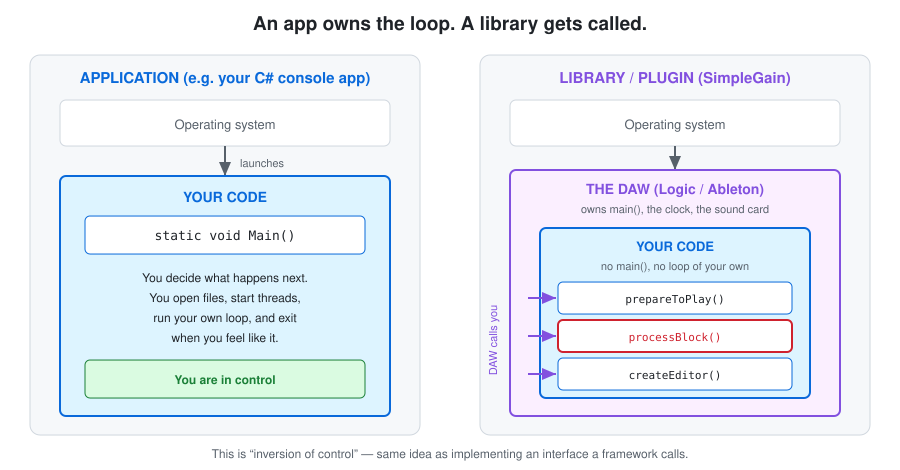
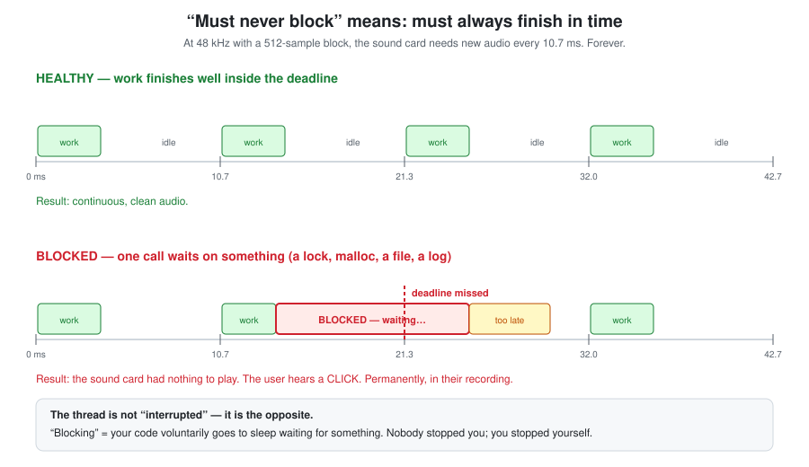
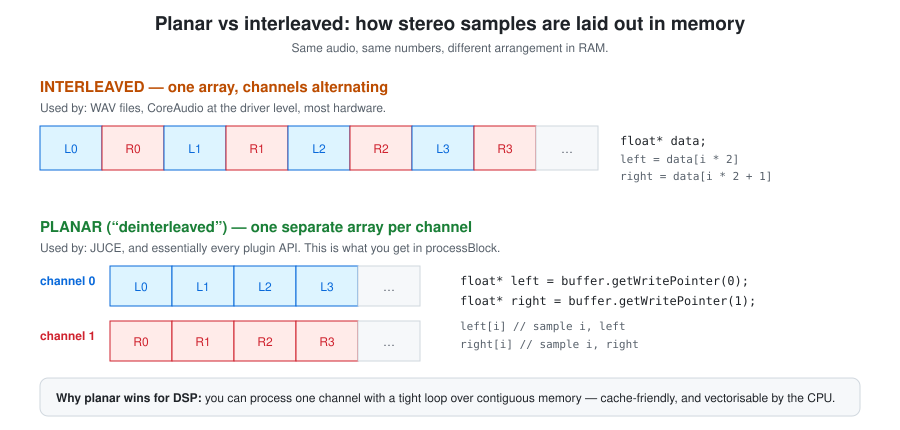
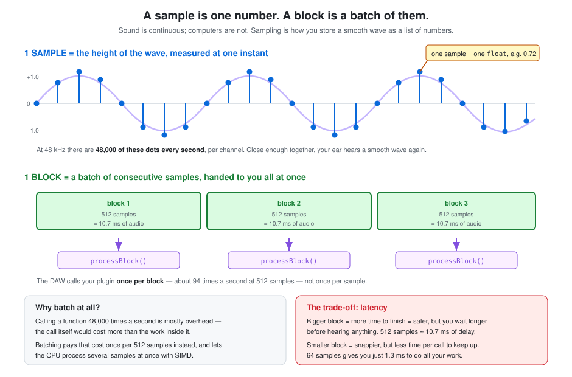

# Plugin hosting & threads

How a DAW and a plugin relate: who calls whom, why the audio thread has rules the message
thread doesn't, and what that has to do with dependency injection.

**SimpleGain docs** · [Index](README.md)  
**The plugin:** [Plan](plan.md) · **Hosting & threads** · [Parameters & automation](parameters-and-automation.md) · [Identity & macOS](plugin-identity-and-macos.md)  
**C++ foundations:** [Memory model](cpp-memory-model.md) · [Build pipeline](cpp-build-pipeline.md)  
**Workflow:** [Dev tooling](dev-workflow-and-tooling.md) · [Testing](testing.md) · [CI & GitHub Actions](ci-and-github-actions.md)

---

## In short

- A plugin is a **library, not an app** — the DAW owns `main()` and calls into you. You never
  drive the loop.
- The DAW owns it because **only one process can hold the sound card** and sample-accurate
  ordering needs a single conductor.
- Two threads matter: the **audio thread** (`processBlock`, hard deadline, must never block)
  and the **message thread** (GUI). Keeping them apart safely drives nearly every design
  decision here.
- A **sample** is one `float` at one instant; a **block** is ~512 of them handed over at once.
  `processBlock` runs per block (~94×/sec), not per sample.
- JUCE buffers are **planar** — one array per channel, not interleaved `LRLRLR`.

---

## 1. What's the difference between an app and a library?

An **app** is something the operating system can *start*. It has an entry point — `Main()` in
C#, `main()` in C++ — and when the OS launches it, control is handed to your code. **You own
the loop.** You decide what happens, in what order, and when to exit.

A **library** has no entry point. It can't be started. It's a bag of functions and classes
that *something else* loads and calls. The library is passive; it waits to be used.



A plugin is a library. Logic Pro is the app. Logic owns `main()`, owns the clock, owns the
connection to your sound card. When you "load SimpleGain", Logic loads our compiled code into
its own process and starts calling our functions.

This pattern — *the framework calls you, rather than you calling the framework* — is called
**inversion of control**, and you've met it in C#:

| C# | Plugin |
|---|---|
| You write a `Controller`; ASP.NET calls your action method | You write an `AudioProcessor`; the DAW calls `processBlock` |
| You write `IHostedService.StartAsync`; the host calls it | You write `prepareToPlay`; the DAW calls it |
| You never call `Main()` on ASP.NET | You never call `main()` on Logic |

### "...except the framework calls you from a hard-real-time thread"

That's the part with no C# equivalent, and it's the whole reason audio programming is its own
discipline.

When ASP.NET calls your controller action, if you take 300 ms, the page is slow. Annoying,
not fatal.

When Logic calls `processBlock`, you have a **hard deadline measured in milliseconds**, and
missing it doesn't make anything slow — it produces an audible click in the user's recording,
permanently. "Hard real-time" means *late is exactly as bad as wrong*.

---

## 2. Why does the DAW own `main()`? Isn't a plugin just icing on someone else's cake?

That's a good way to put it, and yes — that's really it. Three separate forces push toward
"one owner, many guests," and they'd push that way even if nobody cared about making life easy.

### 1. Only one thing can own the sound card

CoreAudio (macOS), ASIO (Windows) and their equivalents grant **exclusive control of the audio
device's callback to one process**. That's an OS/driver-level rule, not a design choice — two
programs cannot both "own" the same audio stream, for the same reason two programs can't both
be the one reading a specific keystroke. Something has to be the single process CoreAudio calls
every 10.7 ms. That's the DAW.

### 2. Sample-accurate order requires one conductor

A DAW project might have an EQ, then a compressor, then our gain plugin, then a reverb send, all
on one track, all mixing into a bus, all needing to line up *sample-for-sample*. If each plugin
ran its own independent loop, nobody could guarantee they'd all finish in the same window, in
the right order, synchronised to the same clock. Centralising it — one thread, walking the
signal chain in a fixed order, calling each plugin's `processBlock` in turn — is what makes
sample-accurate timing possible at all. This is also *why* the audio thread can't block (§2):
if plugin 3 of 8 stalls, everything downstream of it misses the deadline too.

### 3. Economics — a "narrow waist" architecture

You've met this shape before, even if not by that name. It's how the web works: **one** browser
engine renders millions of independent websites, because HTML/CSS/JS is a standardised contract
both sides agree to. It's how ASP.NET Core works: **one** Kestrel host owns the request loop;
you write a controller action, and Kestrel calls you when a request arrives — you'd never write
your own TCP listener per controller.

Same trade here. Building a correct DAW — audio drivers, sample-accurate mixing, a plugin host,
MIDI timing, an editable project format, undo history — is a multi-year, deeply specialised
engineering effort. That's exactly why you can count the serious DAWs on two hands (Logic,
Ableton, Cubase, Reaper, Pro Tools, Studio One, Bitwig, FL Studio…) while there are **thousands**
of plugins. The DAW authors absorb the hard, shared problem once; every plugin author, including
us, only has to implement a handful of lifecycle methods against a standard contract (VST3, AU,
AAX) and gets audio, MIDI, automation, and a signal chain for free.

So: not laziness, and not really "easier" so much as *necessary*. There is no version of this
where 200 independently-running plugin processes negotiate a shared sample-accurate clock among
themselves. Centralising it is the only design that works — and it happens to also be why the
plugin ecosystem is so much bigger than the DAW ecosystem.

---

## 3. What is a thread, and what does "must never block" mean?

### What a thread is

Yes — it's about how a CPU runs code and your instinct is right.

A **thread** is one independent sequence of instructions. Think of it as a worker following
a recipe line by line. Your CPU has 8 cores (I checked — Core i9-9880H), so it can genuinely
run 8 threads *simultaneously*. But your Mac has hundreds of threads alive at once, so the OS
**rapidly switches** between them — a few milliseconds each — creating the illusion that
everything runs at the same time. That switching is called *preemption*.

You've used threads in C# constantly, often without naming them: every `await`, every
`Task.Run`, every background worker.

Our plugin has (at least) two that matter:

| Thread | Runs | Deadline | Analogy |
|---|---|---|---|
| **Message thread** | GUI, clicks, repaints | ~16 ms (60 fps), soft | The WPF/WinForms UI thread |
| **Audio thread** | `processBlock` | 10.7 ms, **hard** | Nothing in C#. Really. |

### What "blocking" means — and it's the opposite of what I assumed

**Blocking is not being interrupted.** It's your own code *voluntarily going to sleep*.

When a thread blocks, it says to the OS: "I can't continue until something else happens —
park me, wake me when it's ready." Nobody stopped you. You stopped yourself.



Things that block:

```cpp
mutex.lock();              // sleeps until whoever holds the lock releases it
auto* p = new float[1024]; // may sleep — the allocator takes an internal lock
std::cout << "hello";      // sleeps on I/O
file.read(...);            // sleeps, possibly for milliseconds
juce::Thread::sleep(1);    // obviously sleeps
```

Every one is completely normal in C#. Every one is forbidden in `processBlock`.

The killer detail is that **you can't bound how long a block lasts**. `mutex.lock()` might
return in 10 nanoseconds, or it might wait 50 ms because the thread holding that lock got
preempted by the OS. You cannot know. And a 50 ms wait inside a 10.7 ms budget is a guaranteed
click.

This specific disaster — a low-priority thread holding a lock that a high-priority thread
needs — is called **priority inversion**, and it's the classic way to ruin audio software.

### Why C# can't do this at all

Even if you wrote perfect C# with no locks and no allocation, the **garbage collector** can
pause your thread at essentially any moment to do its work. You don't control it, you can't
opt out and a GC pause is routinely tens of milliseconds. That's why pro audio DSP is written
in C++ and not C#.

---

## 4. Keeping the two threads apart — wouldn't you just do that anyway?

> *"Wouldn't you just do that as standard if it's so important?"*

You would **want** to. The problem is that the obvious, natural, C#-brained way to write the
code is wrong, and it *looks* fine and *works* in testing. That's what makes it a design
constraint rather than a rule you just follow.

### The trap: sharing a plain variable

Say we store the gain as a normal `float` member. The GUI slider writes it; `processBlock`
reads it:

```cpp
float gain = 1.0f;                        // plain member

// message thread, when the user drags the slider:
gain = newValue;

// audio thread, 187 times a second:
buffer.applyGain (gain);
```

This looks completely reasonable. It will work on your machine. It is still broken, for
reasons that only show up as rare glitches on someone else's computer:

1. **It's a data race** — formally *undefined behaviour* in C++. The compiler is allowed to
   assume no other thread touches `gain`, so it may hoist the read out of the loop and cache
   it in a register forever. Your slider silently stops working in Release builds only.
2. **Torn reads.** A write that isn't atomic can be observed half-finished. You read a value
   that was never written — potentially an enormous number, and now the user's speakers are in
   danger.

The fix is `std::atomic<float>`, which we use in Phase 3. It costs nothing at runtime on x86
but tells the compiler "hands off".

### The traps you hit by accident

These are the ones that get people, because each is *completely normal* everywhere else:

| What you'd naturally write | Why it breaks | What to do instead |
|---|---|---|
| `DBG("gain = " << g)` in `processBlock` to debug it | Logging does I/O and allocates. Adding the debug line *causes* the glitch you're debugging. | Store into an atomic, log from a `Timer` on the GUI thread |
| `std::vector<float> temp(numSamples);` for scratch space | Heap allocation. Blocks. | Allocate once in `prepareToPlay`, reuse it |
| `juce::String name = getParamName();` | `String` allocates | Never touch strings on the audio thread |
| Editor reads a `std::vector` while audio resizes it | Reallocation invalidates the pointer the GUI is holding → crash | Atomics, or a lock-free FIFO |
| `smoothedValue.reset(...)` from the GUI | Mutates state the audio thread is mid-read of | Set an atomic flag; the audio thread acts on it |
| A meter that the audio thread pushes to the GUI | Backwards data flow needs the same care | Audio thread writes an atomic; GUI polls it on a timer |

Notice the shape: **it's never one dramatic mistake.** It's a debug line, a convenience
`vector`, a string. That's why it's a *design constraint* — it informs every small decision,
not one big one.

### Can you have more than one of each?

- **Message thread: exactly one.** Guaranteed by the OS — all GUI work on macOS must happen on
  the main thread. JUCE enforces this.
- **Audio threads: one or more.** A simple setup gives one. But a DAW may run *several* audio
  threads in parallel across CPU cores and hand different tracks to each. If ten instances of
  SimpleGain are on ten tracks, they may genuinely be in `processBlock` **at the same time on
  different cores**. Each instance is a separate object so that's fine — but any *shared*
  static or global state would be a disaster.
- **Other threads exist too.** Look at the crash report: our app had a Timer thread, two
  CoreAudio IO threads, a CoreMIDI thread, a CVDisplayLink thread. Real programs are full of
  threads.

---

## 5. Inversion of Control — and is it the same as the `IoC.cs` file in my C# projects?

**Same family, different axis.** Your `IoC.cs` is one *specific application* of a much broader
idea, and the C#/.NET world has slightly hijacked the term.

### The general principle

The general principle is just: who is in the driving seat? **Inversion of Control** is the idea that *something other than your code decides the flow*.
It's also called the **Hollywood Principle**: *"Don't call us, we'll call you."*

Normal control flow — you're in charge:

```
your code ──calls──► library
```

Inverted — the framework is in charge:

```
framework ──calls──► your code
```

That's it. The question IoC answers is simply: **who is in the driving seat?**

### Your `IoC.cs` file: inverted *construction*

A registration file is IoC applied to **how objects get their dependencies**. The specific name
for this flavour is **Dependency Injection**.

Without it — the class controls its own dependencies:

```csharp
public class OrderService
{
    private readonly IRepository _repo = new SqlRepository();  // I decide. I'm in control.
}
```

With it — control of that decision is inverted:

```csharp
public class OrderService
{
    public OrderService(IRepository repo) { _repo = repo; }    // someone else decides
}

// IoC.cs — the container is told what to hand out
services.AddScoped<IRepository, SqlRepository>();
```

`OrderService` no longer chooses, or even knows, which repository it gets. The container
constructs it and *injects* it.

### Our plugin: inverted *call flow*

SimpleGain inverts a different thing — **when your code runs at all**:

```csharp
// An app: YOU call the framework
static void Main() {
    var audio = new AudioEngine();
    audio.Process(buffer);          // you decide when
}
```

```cpp
// A plugin: the DAW calls YOU
void SimpleGainAudioProcessor::processBlock (AudioBuffer<float>& buffer, MidiBuffer&)
{
    // Ableton decides when. 187 times a second. You just respond.
}
```

**We never call Ableton. Ableton calls us. We don't own `main()`, we don't own the loop, we don't
decide when anything happens.**

### The two side by side

| | **DI container** (`IoC.cs`) | **Plugin architecture** (SimpleGain) |
|---|---|---|
| What's inverted | Who *constructs* your dependencies | Who *calls* your code, and when |
| Who's in control | The container | The DAW |
| You provide | A class with constructor parameters | A class implementing an interface |
| The hook | Registration in `IoC.cs` | `createPluginFilter()`, which the host calls |
| Also known as | Dependency Injection | The Hollywood Principle |

> **Terminology note:** Martin Fowler coined "Dependency Injection" in 2004 *precisely because*
> "IoC" had become too vague — everyone in the Java/.NET world was saying "IoC container" when
> they specifically meant dependency injection. So your instinct that they're related is right,
> and so is the sense that they're not quite the same thing.

### Amusingly, our plugin does both

`createPluginFilter()` is a factory the host calls to construct us — so the host controls our
*construction* too. And look at the editor:

```cpp
SimpleGainAudioProcessorEditor (SimpleGainAudioProcessor& p)   // injected, not constructed
```

The editor doesn't create its processor. It's handed one. That's **constructor injection** —
exactly what your `IoC.cs` arranges, just done by hand instead of by a container. C++ has no
mainstream DI container culture; you wire dependencies manually.

---

## 6. Planar vs interleaved

These are two ways to arrange multi-channel audio in memory. Same numbers, different order.



**Interleaved** = one array, channels taking turns: `L R L R L R`. The two channels of one
moment sit next to each other. This is what's inside a `.wav` file and what sound card drivers
usually want.

**Planar** (also "deinterleaved", or "non-interleaved") = a separate array per channel. All the
left samples in one block of memory, all the right samples in another.

JUCE gives you planar:

```cpp
float* left  = buffer.getWritePointer (0);   // an array of just left samples
float* right = buffer.getWritePointer (1);   // an array of just right samples
left[100]                                    // sample 100, left channel
```

Where with interleaved you'd need `data[100 * 2]` and `data[100 * 2 + 1]`.

**Why planar wins for DSP:** most processing treats channels independently, so you want a tight
loop walking straight through one channel's memory. Contiguous access is dramatically faster —
the CPU prefetches it into cache, and can often use SIMD instructions to do 4 or 8 samples at
once. Interleaved would make you skip over the other channel's data on every step.

---

## 7. "Before any DSP exists" — what does that mean?

**DSP = Digital Signal Processing** — any maths performed on the audio samples. For us,
multiplying every sample by a gain value. For a reverb it'd be a network of delays; for an EQ,
a filter.

"No DSP yet" meant literally: **`processBlock` does not modify a single sample.** Audio comes
in, the identical audio goes out. The plugin is a fully working, host-loadable, `auval`-passing
plugin that happens to be a very elaborate piece of wire.

Not quite an "empty shell" — a lot *is* happening: the host loads us, negotiates channel
layouts, calls `prepareToPlay`, calls `processBlock` 187 times a second and we clear any
unused output channels. It's all the plumbing, with no maths.

**Why do it this way?** So that when something breaks, you know which half broke. If we'd
written the gain maths at the same time and heard nothing, the cause could be the build, the
install path, the channel negotiation, the audio routing, *or* the maths. By proving the
plumbing first, any future silence is definitely the maths.

---

## 8. Samples vs blocks

Two words used constantly and easy to blur together, because they're both "a bit of audio".



### A sample

**One number. The height of the waveform, measured at a single instant, in a single channel.**

It's a `float`, normally between −1.0 and +1.0. That's the whole definition.

Sound in the real world is continuous; computers can't store continuous things, so instead the
wave is measured many times a second and stored as a list of those measurements. That's
*sampling*. At 48 kHz there are **48,000 measurements per second, per channel** — close enough
together that your ear reassembles them into a smooth sound.

### A block

**A batch of consecutive samples, handed to your plugin all at once.**

The DAW doesn't call you for each individual sample. It collects a few hundred and passes them
over in one go, as a buffer:

| Block size | Duration at 48 kHz |
|---|---|
| 64 samples | 1.3 ms |
| 128 samples | 2.7 ms |
| 256 samples | 5.3 ms |
| 512 samples | 10.7 ms |

So `processBlock` runs about **94 times a second** at a 512-sample block — not 48,000 times.

### Why batch at all?

Two reasons, both about efficiency:

1. **Function call overhead.** Calling a function 48,000 times a second, per plugin, per track,
   would cost more in call overhead than the actual work inside. Batching pays that cost once
   per 512 samples.
2. **The CPU can do several at once.** Modern processors have SIMD instructions that apply the
   same operation to 4 or 8 floats simultaneously. That only works if you have a contiguous run
   of samples to hand — which is exactly what a block is (and why
   [planar layout](#6-planar-vs-interleaved) matters too).

### The trade-off: latency

Block size is the one audio setting users actually fiddle with, because it's a direct trade:

- **Bigger block** → more time to finish each call, so less risk of glitching — but you wait
  longer before hearing anything. At 512 samples there's ~10.7 ms of delay in each direction.
- **Smaller block** → snappier response, better for playing an instrument live — but your
  deadline shrinks. At 64 samples you have **1.3 ms** to do everything.

That's the "Audio buffer size" dropdown in the standalone app's Audio/MIDI Settings.

### Why this distinction matters for our plugin

Because it's the difference between smooth and gritty.

As of Phase 3, `processBlock` reads the gain fader **once per block** and applies that single
value to all 512 samples. So the gain updates ~94 times a second, in steps. Each step is a
sudden jump in the waveform, and ears hear sudden jumps as clicks — drag the fader fast and you
get *zipper noise*.

The fix (Phase 4) is to update the gain **once per sample** instead — 48,000 smooth increments
a second rather than 94 chunky ones. `juce::SmoothedValue` does exactly that. See
[Parameters & automation §6](parameters-and-automation.md#6-what-can-ramp-means-in-the-auval-output).

